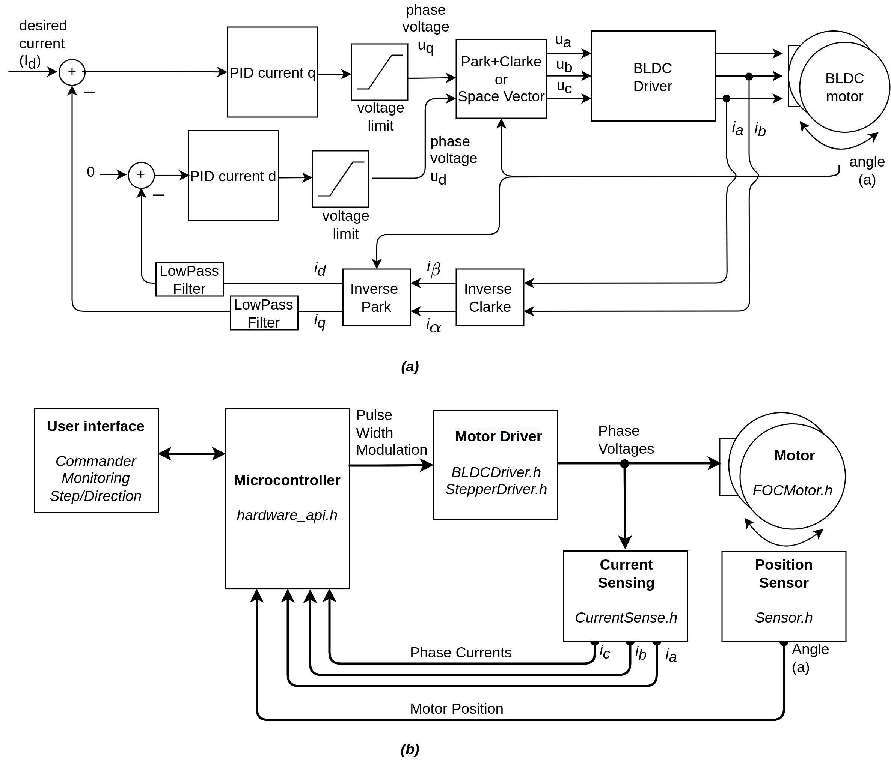

# Summary

Field Oriented Control (FOC) is a well-known strategy for controlling different types of electrically commutated motors (e.g., Alternative Current based, Brushless DC, etc.) via phase-commutation. As opposed to the widely used brushed DC motors, which are by design mechanically commutated, the brushless motors (e.g., BLDC, stepper, AC, etc.) rely on the control algorithms and electronics to create the appropriate magnetic field in the motor to ensure its desired motion. Many techniques [@jalili2009investigation; @bida2018pmsm] have been developed over the years, from which FOC is arguably one of the most efficient ones. However, the FOC approach has several disadvantages, including complex control architecture, limited computational performance, and highly specific [@belhamel2020model; @cheles2008sensorless], to specific microcontrollers, motor drivers, current and position sensors, and motors [@castiglia2018high; @carey2019hybrid; @reddy2016soc].

SimpleFOC has been developed in an effort to provide a more generic and easy-to-use implementation of the FOC method to bolster the rapid development of highly dynamic cyber-physical systems (e.g., control theory experimental setup, dynamic robotic systems, etc.). 

SimpleFOC implements the FOC algorithm routines, generic hardware interfaces, and various configuration parameters encapsulated in an object-oriented C++ library. It provides the users with an intuitive way to develop their motion control application and the possibility to change all the hardware components (motor, sensors, drivers, microcontrollers) with relatively minor code modifications. SimpleFOC supports various RISC-based microcontroller architectures such as Atmega328/2560, MK20 series, STM32 series, SAMD series, RP2040 series, and Xtensa LX6 different platforms such as Arduino UNO, Nucleo, ESP32, Teensy, Portenta, to name a few.  Like many other open-source platforms [@chitta2017ros_control], SimpleFOC takes advantage of using existing software toolchains to facilitate the interoperability of the hardware to use the FOC approach with different microcontrollers. 

As shown in \autoref{fig:scheme}, SimpleFOC provides a modular implementation of the FOC control architecture divided into generic blocks representing classes and hardware as motor, driver, position sensor, current sensing, user interface, and finally, the microcontroller specifics. 
The position sensor blocks are based on the Sensor class, and SimpleFOC provides initial support for hall sensors (HallSensor), magnetic sensors (MagneticSensor), and quadrature encoders (Encoder). Two motor driver classes are supported: BLDC drivers (BLDCDriver3PWM, BLDCDriver6PWM) and Stepper drivers (StepperDriver4PWM, StepperDriver2PWM). The current sensing blocks are based on the CurrentSense class and provide the initial support for the strategies such as inline current sensing (InlineCurrentSense)  and low-side current sensing (LowSideCurrentSense). The motion control classes have been implemented in the BLDC motor (BLDCMotor) and stepper motor (StepperMotor) classes. The motion control classes implement numerous strategies of motion and torque control. SimpleFOC additionally provides several user interfaces such as highly customizable commander (Commander), motor variable monitoring functionality, and the step-direction interface (StepDirListener).

Each block in \autoref{fig:scheme} (b) represents the operational necessities of the FOC \autoref{fig:scheme} (a) as well as all the initialization, calibration, communication functionalities specific to the hardware. This approach enables the several motors, sensor, driver, and microcontroller combinations. \footnote{The list of supported hardware can be found https://docs.simplefoc.com/supported_hardware}

# The Documentation and a Sample Workflow of SimpleFOC
Similar to existing documentation frameworks (e.g., Diátaxis, Procida, 2021), SimpleFOC library is explained with tutorials, how-to guides, and additional references from the literature by using Jekyll-based Just-to-Docs. With that, the intention is to demystify FOC for solving motion control challenges in research and teaching. Several examples in the documentation ease using the SimpleFOC, which runs on microcontroller boards to control the motion of different numbers of actuators to research and teaching of highly dynamic cyber-physical systems. A user can easily set up SimpleFOC library to control the target hardware’s motion by following the workflow in \autoref{fig:setup}.

# Research Interest
SimpleFOC has been a valuable base for several research projects, such as motion control of a five-bar robot arm [@gonzalez2021metodologia], for synthesizing the head motion for a morphable robotic face [@llalitharatnesynthesizing] and for researching the possibility of wireless embedded BLDC solutions [@rohman2021wireless]. Additionally, SimpleFOC has been used for investigating the floating-point precision influence on the control quality of AC Motors [@magnani2021impact]. Furthermore, SimpleFOC has been introduced in educational materials and books [@birglen2016mecatronique]. Therefore, the modularity and the configurability of the SimpleFOC make it an interesting tool for different levels of educational projects while facilitating the testing and development of highly dynamic physical systems.

# Statement of Need
Building highly dynamic systems for research, development, or teaching purposes requires a specific type of actuator that is dynamic enough to respond to the changes of the system under interest [@seok2012actuator]. This type of actuator should maximize torque density and minimize the effect of the perturbations while working in a relatively wider bandwidth. The actuators that can facilitate these requirements [@katz2018low] are arduous to control and use for research or teaching purposes. Well-documented and turn-key solutions are expensive and complicated to improve due to their proprietary nature. On the other hand, open-source solutions provide limited control features and are not too well-documented to apply FOC on various hardware platforms. These limitations point to the need to develop a widely accessible, open-source solution to ease the building or development of dynamic systems for research and teaching. The presented library, SimpleFOC, facilitates a well-documented solution for various types of well-known and widely used microcontroller platforms, drivers, motors, and sensors. By the time of this writing, SimpleFOC has more than 200 active forks in GitHub, 400 members in its community platform with over 500 discussions, and 6000 posts exchanged between its members.

# Acknowledgments
The authors would like to thank the community for the continuous and generous support of the SimpleFOC project.

# References